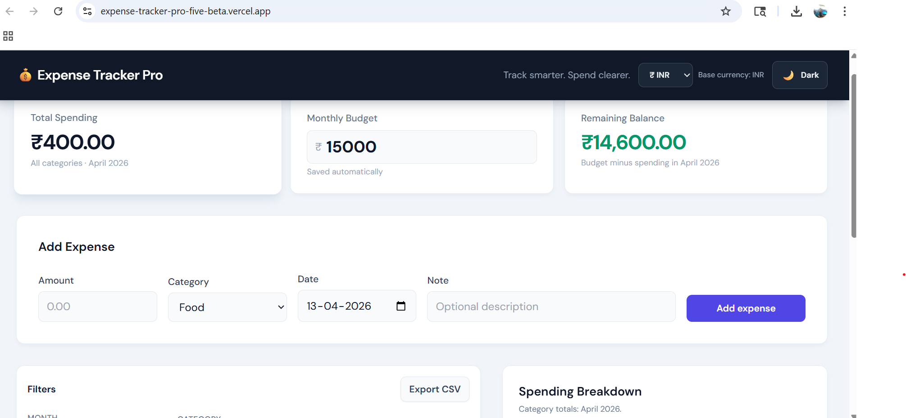
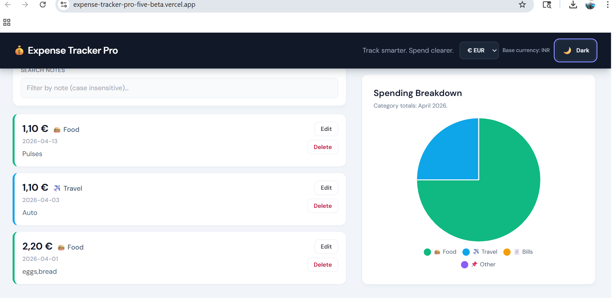
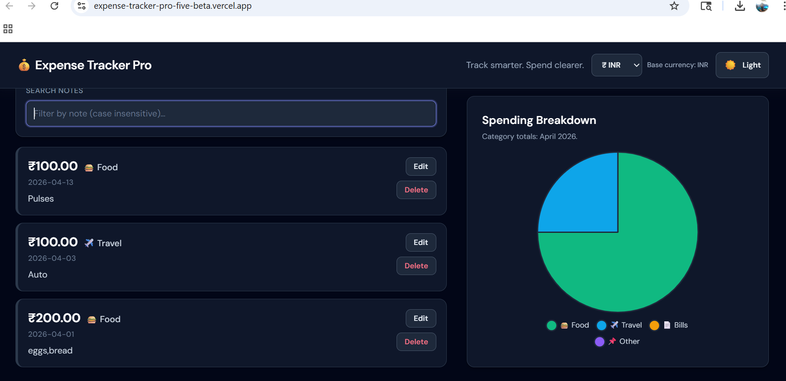
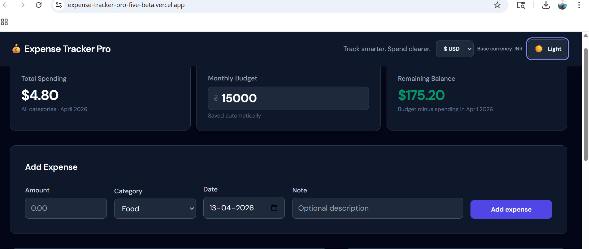

# 💰 Expense Tracker Pro

A modern expense tracker with multi-currency support, analytics, and clean UI.

## 🌐 Live Demo
[https://expense-tracker-pro-five-beta.vercel.app/)]

## 🚀 Features
- Add, edit, delete expenses
- Monthly budget tracking
- Multi-currency support (INR, USD, EUR)
- Dark mode
- Charts (category-wise spending)
- Export to CSV
- Search and filters
  
 ## 🧠 Key Engineering Highlights
- Base currency architecture (INR)
- Safe display-only currency conversion
- Modular JavaScript design
- Combined filtering (month, category, search)

## 🛠 Tech Stack
- HTML
- Tailwind CSS
- JavaScript
- Chart.js

## ⚙️ How It Works
- Data stored in localStorage
- All values stored in INR
- Currency conversion applied only for display

## 📸 Screenshots

### 🏠 Dashboard

### 💱 Currency Change

### 📊 Chart View

### 🌙 Dark Mode

